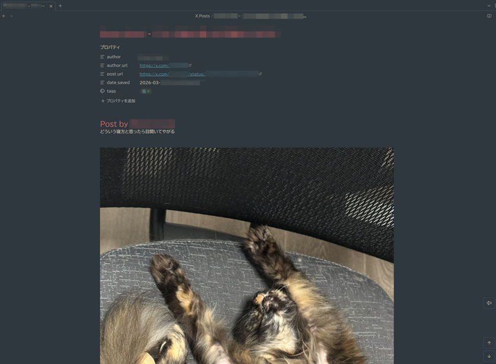
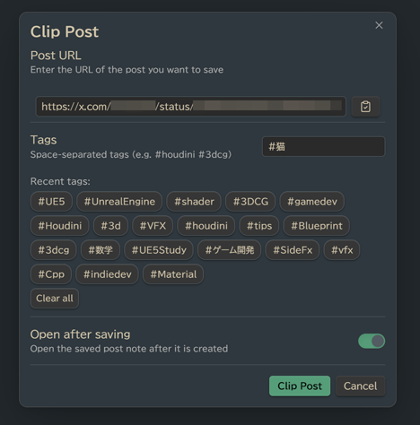

# X Clipper

X（Twitter）のポストを、画像・動画・ハッシュタグを含めて Markdown ノートとして Obsidian に保存するプラグインです。

Japanese README → [README.ja.md](README.ja.md)





## 機能

- **ポストをクリップ**  
  X（Twitter）のURLを貼り付けるだけで保存できます

- **画像・動画をダウンロード**  
  投稿に含まれる画像や動画を Vault の attachments フォルダに保存します

- **ハッシュタグを自動抽出**  
  投稿テキストからハッシュタグを抽出し、タグとして保存します（frontmatter とインラインの両方）

- **タグ候補表示**  
  使用履歴に基づいたタグをトグルボタンで提案します

- **前回使用したタグを記憶**  
  前回保存時に手動で選択したタグを自動で有効化します

- **Clear all ボタン**  
  タグ選択をワンクリックでリセットできます

- **リボンにカスタム X アイコン**  
  ワンクリックでポストをクリップできます

- **日本語対応**  
  ファイル名やタグに日本語を使用できます

- **フォールバック API**  
  fxtwitter が利用できない場合、自動的に vxtwitter を使用します

## インストール

### Community Plugins から（推奨）

1. **Settings → Community plugins** を開く  
2. **Browse** をクリックして「X Clipper」を検索  
3. **Install** をクリックし、その後 **Enable**

### 手動インストール

1. [最新リリース](https://github.com/RyotaUnzai/x-clipper/releases) から  
   `main.js`、`manifest.json`、`styles.css` をダウンロードします
2. Vault 内に `.obsidian/plugins/x-clipper/` フォルダを作成します
3. ダウンロードしたファイルをそのフォルダにコピーします
4. Obsidian を再起動し、**Settings → Community plugins** でプラグインを有効化します

## 使い方


1. リボンの **𝕏 アイコン** をクリックするか、コマンドパレットから **Clip Post** を実行します
2. 投稿URLを貼り付けます  
   （例：`https://x.com/username/status/123456789`）
3. 必要に応じてタグを追加または切り替えます
4. **Clip Post** をクリックします

プラグインは次の処理を行います：

- 投稿テキストと投稿者情報を取得
- 添付された画像や動画を `{Posts folder}/attachments/` にダウンロード
- frontmatter、埋め込みメディア、タグを含む Markdown ノートを作成

## 設定

| 設定 | 説明 | デフォルト |
|-----|-----|-----|
| Posts folder | クリップした投稿を保存するフォルダ | `X_Posts` |
| Copy note path to clipboard | 保存後に `[[note]]` リンクをクリップボードへコピー | On |
| Open saved note after saving | 保存後すぐにノートを開く | Off |

## 保存されるノート形式

```markdown
---
author: "Author Name"
author_url: "https://x.com/username"
post_url: "https://x.com/username/status/123"
date_saved: 2025-01-01T12:00:00.000Z
tags: ["houdini", "3dcg", "VFX"]
---

# Author Name の投稿

投稿本文...

![[post_img_1234567890_1.jpg]]

---

#houdini #3dcg #VFX

**Author:** [Author Name](https://x.com/username)  
**Original Post:** [View on X](https://x.com/username/status/123)  
**Saved:** 2025年1月1日 12:00
```

## API

このプラグインは投稿データの取得に  
[fxtwitter](https://github.com/FixTweet/FixTweet) API を使用します。  

fxtwitter が利用できない場合は  
[vxtwitter](https://github.com/dylanpdx/BetterTwitFix) を自動的に使用します。

認証や API キーは必要ありません。
